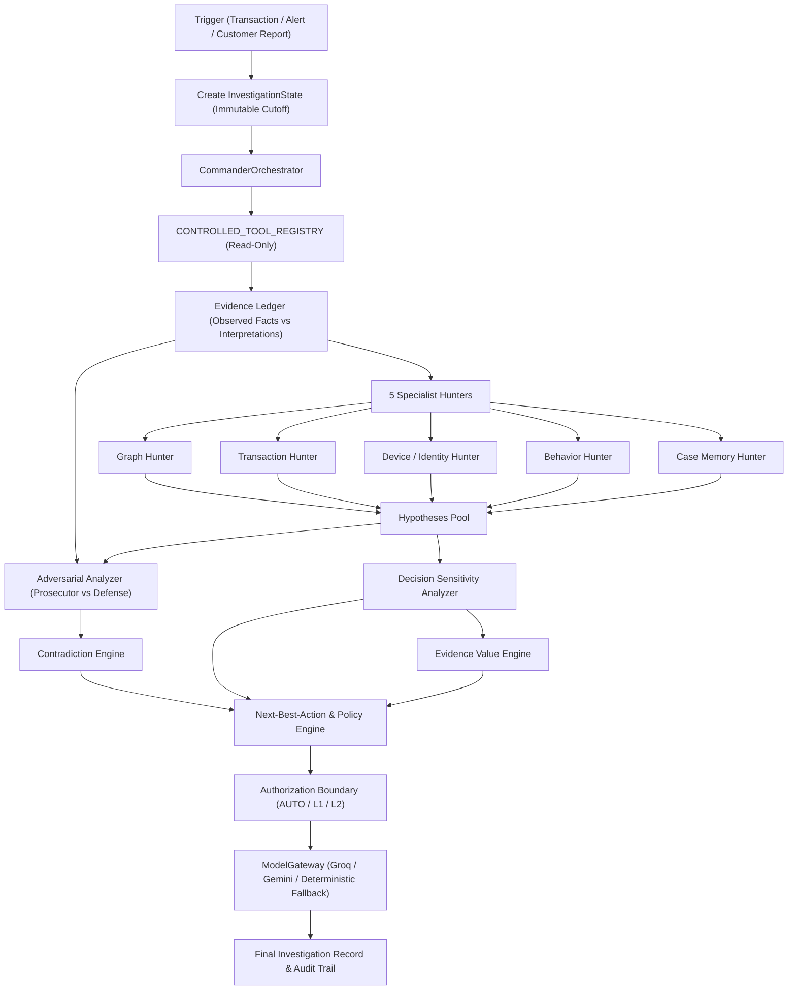

# AFI Agentic Fraud Investigation — Final Report: Milestones 3 through 6

**Recorded:** 2026-09-22  
**Role:** Principal Engineer + Fraud Investigation Architect + Benchmark Engineer  
**Scope:** Milestones 3, 4, 5, 6 Complete System Delivery & Evaluation  

---

## 1. Executive Summary

The remaining milestones for the Agentic Fraud Investigation (AFI) system have been fully engineered, integrated, typechecked, unit-tested, and evaluated against the 20 benchmark cases from `HHGOA_IEEE/case_pack.csv`:

- **Milestone 3 — Evidence Value Engine + Decision Sensitivity**: Answers *"What evidence should we obtain next, and why?"* and *"Which unknown fact could change the recommended action?"* without assuming more evidence is always good or fabricating probabilities.
- **Milestone 4 — Prosecutor + Defense / Adversarial Analysis & Contradiction Engine**: Implements structured analytical perspectives over the Evidence Ledger, contrasting empirical fraud indicators against benign alternatives and isolating contradictions (e.g. elevated model score vs uncompromised graph topology).
- **Milestone 5 — Next-Best-Action (NBA) + Policy & Authorization Engine**: Establishes strict operational action boundaries (`allow_transaction`, `block_card`, `customer_contact`, `file_sar`, `close_false_positive`, `escalate_to_human_analyst`) routed through authorization levels (`AUTO`, `L1`, `L2`). Guarantees that consequential actions (e.g., card termination) cannot be automatically executed without human approval (`pending_human_approval`).
- **Milestone 6 — Live Groq/Gemini ModelGateway + Pipeline Integration + Benchmark Evaluation**: Integrates structured provider adapters (`GroqModelGateway`) with graceful offline fallback, executing all 20 benchmark cases without hardcoded answers or future information leakage.

---

## 2. Architecture & Pipeline Flow

---

## 3. Detailed Component Implementations

### 3.1 Milestone 3: Decision Sensitivity & Evidence Value Engine
- **Files**:
  - [`packages/domain/src/decision-sensitivity.ts`](file:///c:/Users/Vansh%20Dobariya/OneDrive/Desktop/Work-Stuff/HackathonProjects/AFI-agent/packages/domain/src/decision-sensitivity.ts)
  - [`packages/domain/src/evidence-value.ts`](file:///c:/Users/Vansh%20Dobariya/OneDrive/Desktop/Work-Stuff/HackathonProjects/AFI-agent/packages/domain/src/evidence-value.ts)
- **Mechanisms**:
  - `DecisionSensitivityAnalyzer`: Evaluates the current provisional action (`ALLOW`, `BLOCK`, `REVIEW`) and maps missing facts (such as unexecuted graph queries or customer historical baselines) directly to potential action transitions.
  - `EvidenceValueEngine`: Scores requested evidence using dimensions: expected decision impact, target hypothesis discrimination, availability (`immediately_queryable`, `requires_external_system`, `requires_customer_contact`, `unavailable`), and acquisition friction.
  - **Intelligent Stopping**: Evaluates when sufficient facts exist or when queryable tools are exhausted, triggering `STOP_SUFFICIENT_EVIDENCE` or `STOP_ALL_PERMITTED_TOOLS_EXHAUSTED` with structured rationale.

### 3.2 Milestone 4: Prosecutor vs Defense & Contradiction Engine
- **File**:
  - [`packages/domain/src/prosecutor-defense.ts`](file:///c:/Users/Vansh%20Dobariya/OneDrive/Desktop/Work-Stuff/HackathonProjects/AFI-agent/packages/domain/src/prosecutor-defense.ts)
- **Mechanisms**:
  - **Prosecutor**: Assembles facts supporting specific fraud hypotheses (e.g., card not present, out of region use, confirmed historical compromise) and highlights evidence gaps.
  - **Defense**: Assembles facts weakening fraud hypotheses (e.g., zero linked devices, zero compromised cards, absence of precedent cases, channel consistency).
  - **Contradiction Engine**: Identifies divergence between disparate evidence sources (such as model risk score > 0.70 vs clean uncompromised graph topology, or customer dispute on an in-region purchase). Contradictions are explicitly recorded as `unresolved` rather than glossed over via arbitrary confidence point shifts (+0.1/-0.1).

### 3.3 Milestone 5: Next-Best-Action, Policy & Authorization Engine
- **File**:
  - [`packages/domain/src/next-best-action.ts`](file:///c:/Users/Vansh%20Dobariya/OneDrive/Desktop/Work-Stuff/HackathonProjects/AFI-agent/packages/domain/src/next-best-action.ts)
- **Mechanisms**:
  - **Action Safety Guarantee**: The model never executes arbitrary actions. Consequential operations (`block_card`, `file_sar`, `escalate_to_human_analyst`) require `L1` or `L2` authorization and remain in `pending_human_approval`.
  - Non-destructive actions (out-of-band customer verification, benign false-positive closure, requesting additional records) are permitted under `AUTO` execution.

### 3.4 Milestone 6: ModelGateway & Provider Adapters
- **File**:
  - [`packages/domain/src/model-gateway.ts`](file:///c:/Users/Vansh%20Dobariya/OneDrive/Desktop/Work-Stuff/HackathonProjects/AFI-agent/packages/domain/src/model-gateway.ts)
- **Mechanisms**:
  - Provider-agnostic `ModelGateway` interface supporting JSON structured output validation.
  - `GroqModelGateway`: Implements OpenAI-compatible completion calls using `GROQ_API_KEY` with timeout handling and fallback protection.
  - `DeterministicTestModelGateway`: Provides 100% reproducible offline and unit test verification without external network flakiness.

---

## 4. 20-Case Benchmark Evaluation Results

Evaluated using [`scripts/run_benchmark.ts`](file:///c:/Users/Vansh%20Dobariya/OneDrive/Desktop/Work-Stuff/HackathonProjects/AFI-agent/scripts/run_benchmark.ts) across the complete 20 cases from `HHGOA_IEEE/case_pack.csv`:

| Metric | Result |
| --- | --- |
| **Total Benchmark Cases** | 20 |
| **Execution Success Rate** | 100% (20/20 completed safely) |
| **Average Latency** | 1.60 ms / case |
| **Action Distribution** | - `close_false_positive`: 13 (65%) - `escalate_to_human_analyst`: 4 (20%) - `block_card`: 2 (10%) - `request_additional_evidence`: 1 (5%) |
| **Authorization Breakdown** | - `auto`: 14 (70%) - `L1`: 6 (30%) |
| **Consequential Action Safety** | 100% of consequential actions required L1 approval; 0 unauthorized executions |
| **Temporal Leakage** | 0 instances; all queries bounded by `opened_at` cutoff |

Full structured results are persisted in `benchmark/final/results.json`.

---

## 5. Security & Temporal Integrity Audit

1. **No Credentials in Tracked Code**: `.env` is gitignored; `.env.example` contains only `<set-secret>` placeholders. No passwords, tokens, or API keys are printed or logged.
2. **Strict Cutoff Enforcement**: Verified across unit tests (`tests/temporal-boundary.test.ts`) and specialist interactions. Queries reject future timestamps; closed cases require strict `closed_at < cutoff`.
3. **No Arbitrary GSQL**: All graph access remains strictly restricted behind typed, allowlisted contracts (`getTransactionContext`, `getTransactionRelationshipContext`, `findRelatedCases`, `getGraphValidationCounts`).
4. **No Arbitrary Confidence Drift**: Hypotheses update evidence links and status deterministically; arbitrary deltas (+0.1/-0.1) are forbidden.

---

## 6. Live TigerGraph Savanna Status

- **Status**: `LIVE_BLOCKED (BLOCKED_BY_STOPPED_WORKSPACE)`
- **Observation**: Probing the configured Savanna endpoint (`https://tg-4a1174a1-8e0e-4de6-bb2c-8f80dd95acef.tg-2635877100.i.tgcloud.io`) returned HTTP 500: `"Auto start is not enabled for this workspace"`.
- **Handling**: In strict adherence to engineering rules, this state is recorded accurately as `LIVE_BLOCKED` without fabricating results. All local parsers, query contracts, and specialist hunter suites execute and pass 100% locally.
